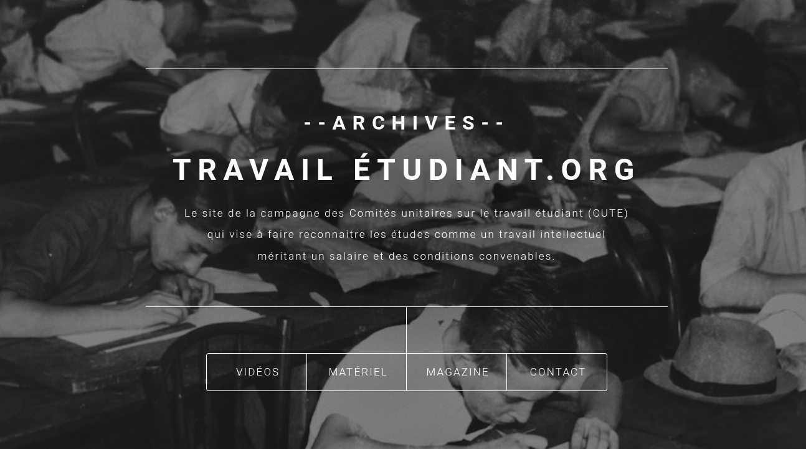
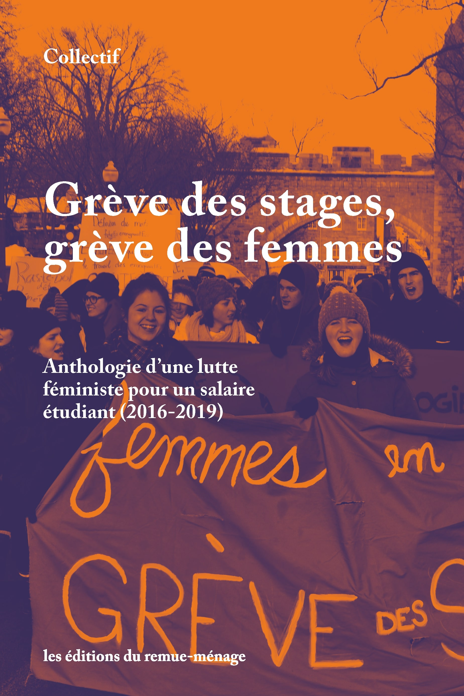

Between 2016 and 2019, the Student Work Unitary Committees, SWUC (CUTE in french: *Comités Unitaires sur le Travail Étudiant*), led a campaign to gain recognition for the work done by students by demanding student wages and paid internships.

#### Website 

#### Book

